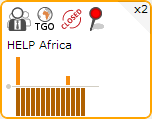
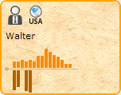
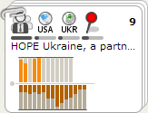

Concepts
========

This topic describes the concepts and terminology used throughout the Influent user interface to display and describe transaction flow patterns and their actors. The concepts in this topic include:

1.  [Accounts](#accounts)
    1.  [Account Cards](#account-cards)
    2.  [Account Actions](#account-actions)

2.  [Clusters](#clusters)
    1.  [Cluster Stacks](#cluster-stacks)
    2.  [Cluster Actions](#cluster-actions)

3.  [Workspace](#workspace)
    1.  [Columns](#columns)
    2.  [Files](#files)
    3.  [Branching](#branching)
    4.  [Transaction Flow Lines](#transaction-flow)
    5.  [Highlighted vs. Selected](#highlight-select)

Accounts
--------

Accounts represent individual actors in the transaction flow. Influent can distinguish actors of various types. In the Kiva data, for example, there are three types of accounts:

-   Lenders, who donate money to partners to fulfill a requested loan, then receive money from the partner once the borrower begins repaying the loan.
-   Partners, who receive money donated by lenders, distribute it to the borrower, manage repayments from the borrower and redistribute them back to the original lenders.
-   Borrowers, who request loans, receive money from partners, then make repayments back to the partner based on the terms of the loan.

Each account is associated with a set of account details (e.g., name, location, description and a photograph) and a set of transaction details, including the identity of the other accounts the transactions were carried out with, the date on which they occurred and their value.

### Account Cards

In the Influent [workspace](#workspace), individual accounts are represented by cards. By default, each card displays:

-   The **Name** of the Account. This could be the name of the borrower or lender or the name of the partner organization handling the loan transactions.
-   **Summary Icons**. These icons give a quick overview of the account. Hover over an icon to view a tooltip explaining what it represents. The Kiva data example uses the following icons are used:
    -   **Type**: Indicates whether the account is a Lender , Partner  or Borrower .
    -   **Location** : Lists the ISO country code in which the account owner is located.
    -   **Status** : Indicates whether the account has closed or defaulted.
    -   **Warnings** : Indicates whether the account has a high delinquency rate or a high default rate.
-   An **Account Activity Histogram**. This chart shows the account's transaction history over the selected Transaction Flow period. Transactions flowing into the account are represented above the x-axis, while transactions flowing out of the account are represented below the x-axis.
-   If the card appears more than once in a transaction flow, a display **Counter** appears in the upper right corner of the card. For example, money flow out of an account can flow back to the originating account.

In addition to the summary iconography, a card's background may also indicate information about the data source:

-   **White Background**: The data set for the account represented by the card is complete, and there is no uncertainty about its transactions.
-   **Parchment Background**: The data set for the account represented by the card is incomplete. Uncertainty exists about the exact transactions the account has made. In the Kiva data, parchment backgrounds are displayed for all lender accounts, as the total amount of each loan to the borrower is known, but not the exact amount from each lender.
    

### Account Actions

Mouse over an account card in the workspace to reveal the actions you can perform on the card. See the [Workspace](#workspace) section in this topic for more information on actions you can perform on account cards.

-   **Highlight Flow** : Makes the card the main focal point in the Influent [workspace](#workspace). All other Activity History charts in the workspace are scaled in proportion to the transaction values on the highlighted card. In addition, direct transactions (in Account Activity charts and flow lines) are denoted in color to distinguish the involvement of the highlighted card. Unrelated and indirect transactions are displayed in grayscale.
-   **Add to File** : Only available for cards in the search results. Adds the card to the [file](#files) under which the search was performed. Files are used to distinguish accounts of interest and manage the workspace.
-   **Move to New File** : Only available for cards in the workspace that have been [branched](#branching) off of filed cards. Creates a new file with the same name as the card and adds the card to it.
-   **Remove** : Removes the card from the workspace, file or search results.
-   **Search for Similar Accounts** : Not available for cards in the search results. Initiates an Advanced Search dialog prepopulated with attributes of the selected card.
-   **Branch** : Not available for cards in the search results until they are filed. Left and right **Branch** buttons expand the accounts with which the card has participated in transactions.

Click on an account card to see that account's information in the [Details Pane](interface.md#details-pane).

Clusters
--------

In order to organize and simplify the workspace layout, returned search results and [branched](#branching) transactions, Influent often groups together similar [accounts](#accounts) into clusters. Clusters can contain individual accounts and/or other clusters to form a hierarchy. The Influent hierarchical clustering algorithm can be configured to sort accounts based on any attribute. In the Kiva data, accounts are clustered together based on the following hierarchical rules:

1.  **Categorical Sort on Account Type**: Influent first groups accounts together based on type. Accounts in the Kiva data are grouped by lenders, partners or borrowers.
2.  **Geographical Sort on Location**: If the clustered accounts are all of the same type, Influent may further sort the accounts by geography. Geographical clusters are also hierarchical. Influent first sorts by continent, then region (e.g., Central Africa or Eastern Africa), country and finally similar latitude/longitude (if available).
3.  **Label Sort on Account Name**: Finally, Influent will cluster accounts with similar names. For example, Thus, "Héctor" and "hector " are treated as the same name and sorted together, as are "John Doe" and "Doe John". By default, the label sort groups similar names alphabetically, then performs a fuzzy string matching to cluster accounts with similar names. Fuzzy string clustering:
    -   Removes leading and trailing non-printing characters and special characters from the account names
    -   Converts all characters to lower case
    -   Changes accented characters to their ASCII representation
    -   Sorts all unique, white space-separated parts of the name

Each cluster is associated with a summary of the account attributes and total transaction data of the individual account members in the group. By default, a cluster can contain a maximum of 10 accounts and/or sub-clusters. This value can be configured for each Influent deployment.

### Cluster Stacks

Similar to individual [accounts](#accounts), clusters are represented in the Influent [workspace](#workspace) as a stack of cards held together by a paperclip. Clicking on the paperclip expands and reveals the individual accounts and sub-clusters that comprise the cluster. The top card of the unexpanded stack displays:

-   The cluster **Name** is chosen from one of the associated individual accounts in the cluster.
-   **Summary Icons**: These icons give a quick overview of the member accounts and sub-clusters in the group. A bar is displayed under each icon indicates the percentage of accounts in the cluster with the corresponding attribute. In the Kiva data, the following icons are used:

    -   **Type**: Indicates whether the members are Lenders , Partners  or Borrowers .
    -   **Location** : Lists each of the ISO country codes in which member accounts owner are located.
    -   **Status** : Indicates the percentage of member accounts that are closed.
    -   **Warnings** : Indicates the percentage of member accounts with high delinquency rates or a high default rates.
-   A **Cluster Activity Histogram**. This chart shows the total transaction history of all the cluster members over the selected Transaction Flow period. Transactions flowing into the accounts are represented above the x-axis, while transactions flowing out of the accounts are represented below the x-axis.
-   A **Member Count** in the upper right corner of the stack. This is total number of individual accounts in the cluster and any sub-clusters.

In addition to the summary iconography, a stack's background also indicates information about the data source:

-   **White Background**: The data set for the cluster represented by the stack is complete, and there is no uncertainty about its transactions.
-   **Parchment Background**: The data set for the cluster represented by the stack is incomplete. Uncertainty exists about the exact transactions the cluster has made. In the Kiva data, parchment backgrounds are displayed for all clusters of lenders, as the total amount of each loan to the financier is known, but not the exact amount from each lender.

### Cluster Actions

Mouse over a cluster stack in the [workspace](#workspace) to reveal the actions you can perform:

-   **Unstack** : Expands the member [accounts](#accounts) and sub-clusters that make up the stack.
-   **Restack** : Collapses the member accounts and sub-clusters that make up the stack.
-   **Highlight Flow** : Makes the cluster the main focal point in the Influent workspace. All other Activity History charts in the workspace are scaled in proportion to the transaction values on the highlighted stack. In addition, direct transactions (in Account Activity charts and flow lines) with the highlighted stack are denoted in color. Unrelated and indirect transactions are displayed in grayscale.
-   **Add to File** : Only available for stacks in the search results. Adds the stack to the [file](#files) under which the search was performed.
-   **Move to New File** : Only available for stacks in the workspace that have been [branched](#branching) off of filed cards. Creates a new file with the same name as the stack and adds the stack to it.
-   **Remove** : Removes the stack from the workspace, file or search results.
-   **Search for Similar Clusters** : Not available for stacks in the search results. Initiates an Advanced Search dialog prepopulated with attributes of the selected stack.
-   **Branch** : Not available for stacks in the search results until they are filed. Left and right **Branch** buttons expand the accounts with which the stack has participated in transactions.

Click on an account card to see that account's information in the [Details Pane](interface.md#details-pane).

Workspace
---------

The Influent workspace is your desktop for viewing, investigating and assessing transaction flows and [accounts](#accounts). The workspace is separated into [columns](#columns), each of which can contain any number of [files](#files) in which you organize accounts for investigation or unfiled accounts that [branch](#branching) off of accounts of interest.

### Columns

A column in the Influent workspace is an invisible entity used to emphasize the left-to-right flow of transactions. [Accounts](#accounts) in columns on the left send transactions to accounts on the right. Columns can contain [files](#files) or unfiled [branched](#branching) accounts.

#### Column Actions

Mouse over the workspace above a column

-   **Sort Column** : Sorts all accounts in the column by their Incoming Flow, Outgoing Flow or Both.
-   **Clear Column** : Removes all unfiled content (branched accounts) from the column.
-   **Add New File** : Creates a new empty file in the column.

### Files

In the Influent [workspace](#workspace), files are used to store and organize [accounts](#accounts) and [clusters](#clusters) you want to investigate. Every new workspace starts with one empty file and a Search Panel. In order to the view the transaction flow involving an account or cluster in your search results, you must first add its [card](#account-cards) or [stack](#cluster-stacks) to a file.

You can add search results to a file by mousing over the desired result and clicking its **Add to File** button. When you add an account or cluster to a new file, the file inherits the account or cluster name. You can change this name at any time by double clicking on it.

Accounts added to files are clustered to automatically organize them within the file using hierarchical entity clustering. As new accounts are added to a file, Influent will automatically create a new cluster containing all of the members in the file.

#### File Actions

Mouse over a file in the workspace to reveal the actions you can perform:

-   **Search for Accounts to Add**: Opens the Search Panel for the selected file.
-   **Remove**: Removes the file from the workspace.

### Branching

Once you have [filed](#files) a result, you can begin investigating the transactions in which the [account](#accounts) or [cluster](#clusters) of interest has participated. Mouse over the account or cluster to reveal its **Branch** buttons. Click the left **Branch** button to view transactions flowing into the account or the right **Branch** button to view the transactions flowing out of the account.

Note that you cannot create branches directly from accounts in your search results. You can only branch from accounts saved in files or from accounts branched off of accounts saved in files.

### Transaction Flow Lines

Lines between [accounts](#accounts) and [clusters](#clusters) in the Influent [workspace](#workspace) indicate transaction flow. The wider the lines, the greater the value of the transaction between the actors.

Transaction flow is always depicted as moving left to right. Accounts are arranged in [columns](#columns). Columns on the left side contain accounts that send transactions to accounts in the column to their right.

Note that depending on your data source, an individual account may appear in both the left and right branches of an account you are investigating. In the Kiva data, for example, all transactions are part of the organization's microloan structure. Therefore, it is common for an account to both initiate (lend) and accept (receive repayments) transactions with the same account. Understanding the expected transactional patterns in your data source is the key to using Influent to find accounts of interest.

### Highlighted vs. Selected

Two terms used throughout this help that should not be confused are "highlighted" and "selected":

-   A **highlighted** [account](#accounts) or [cluster](#clusters) is the current main focal point of the Influent [workspace](#workspace). The highlighted [card](#account-cards) has an orange border. The following transaction flow details associated with all other cards in the workspace are drawn in relation to the highlighted card:

    -   Account Activity Histograms are scaled in relation to the proportions of the highlighted account.
    -   Transactional data is represented (all charts and flow lines) in grayscale, except for portions of those transactions made directly with the highlighted account, which are represented in color.

    To change the highlighted card in the workspace, mouse over the desired card and click its **Highlight Flow**  button. Influent will refresh the workspace to redisplay the transaction history of all other cards relative to the newly highlighted card.

-   A **selected** account or cluster is one for which the Details Pane is currently displayed. The selected card has a blue border.
    To change the selected card, simply click a new card in the workspace.

